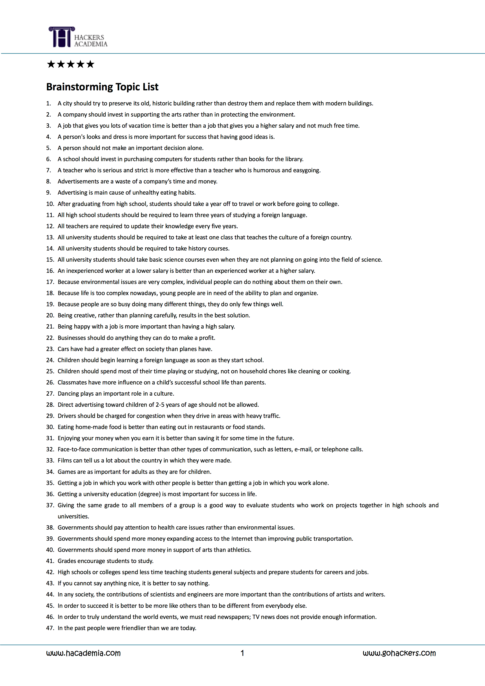
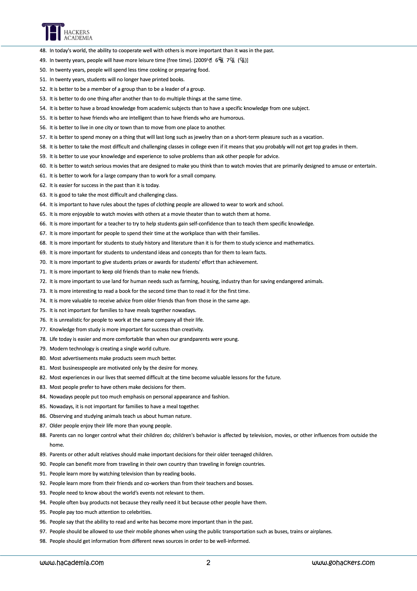
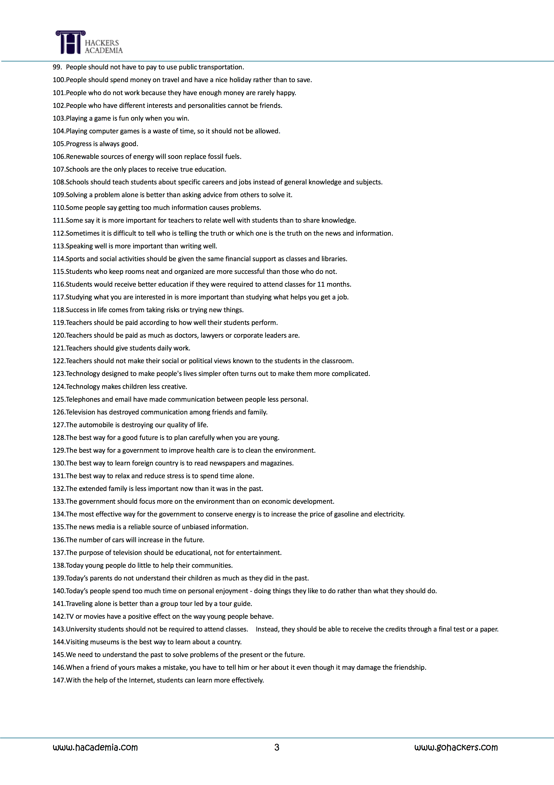

# English and Japanese Writing Practice
English and Japanese Writing Practice 原田とビクトル 
# Rules
1. Upload a draft everyday 
2. Check each other's drafts and upload correction!
# Examples
See example folder for structure example and how to perform corrections.
# Writing Topics

## Materials
* http://www.hackerstoefl.com/?c=data/toefldata&p=6&uid=307536
* https://www.youtube.com/results?search_query=walking+up+podcast
* https://www.youtube.com/results?search_query=jlpt+listening+n3+part+1
